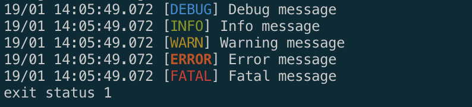

# minilog
Golang minimalistic package for logging

The possibility color output logs

The possibility write log to file

```
go get github.com/wired-R/minilog

```

Example

```go
package main

import log "github.com/wired-R/minilog"

func main() {
    //set debug log level
    log.Level = 0

    // Write log to file 
    log.Output, err = os.OpenFile("file.log", os.O_RDWR|os.O_APPEND|os.O_CREATE, 0666)
    if err != nil {
        log.Fatal(err)
    }

    log.Debug("This is debug message")
}
```

